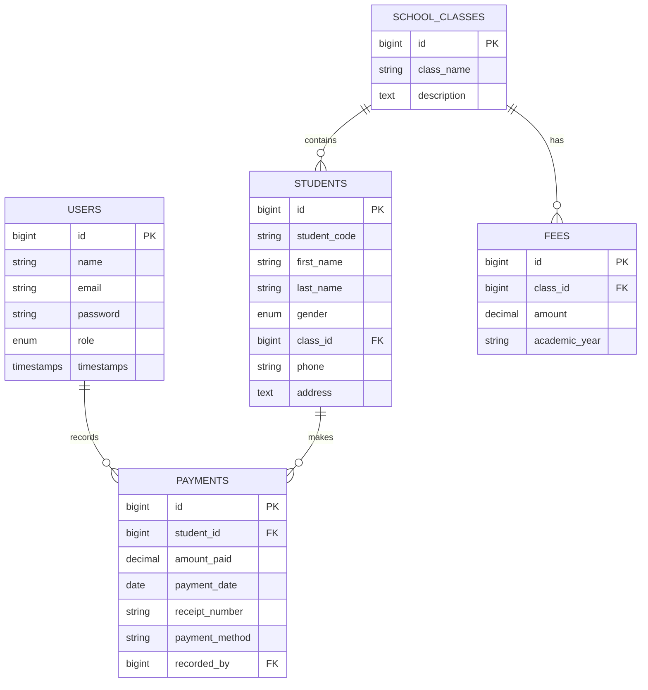
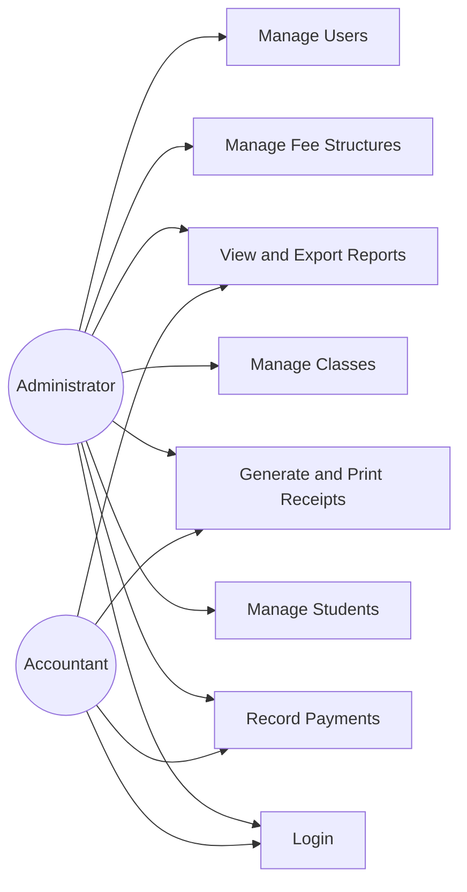

# School Fee Management System Documentation

## 1. Problem Statement

A secondary school records fees manually, causing lost receipts, slow balance tracking, fee calculation errors, and difficult reporting. The School Fee Management System digitizes student registration, class fee setup, payment recording, automatic receipt generation, balance calculation, and financial reporting.

## 2. Objectives

- Provide secure login for administrators and accountants.
- Manage students, classes, fee structures, payments, receipts, reports, and users.
- Automatically calculate paid amounts and outstanding balances.
- Generate PDF and Excel-compatible reports.
- Present a professional, responsive admin interface suitable for TVET or university assessment.

## 3. Functional Requirements

- Users can authenticate and log out securely.
- Administrators can manage students, classes, fees, payments, reports, and users.
- Accountants can record payments, print receipts, and view reports.
- Receipts are generated using the `REC-YYYY-0001` format.
- Reports can be filtered by date, class, and student.
- Dashboards display counts, collections, expected fees, and balances with charts.

## 4. Non-Functional Requirements

- Secure password hashing, CSRF protection, route middleware, and server-side validation.
- Responsive Bootstrap 5 user interface.
- Eloquent ORM relationships for maintainable data access.
- Seeded demonstration data for quick assessment.
- Clean Laravel 10 structure following MVC conventions.

## 5. ERD

## 6. Use Case Diagram

## 7. Database Design

The system uses `users`, `school_classes`, `students`, `fees`, and `payments`. Foreign keys preserve referential integrity between classes and students, classes and fee structures, students and payments, and users and payment recorders.

## 8. Testing

Recommended test cases:

- Login with admin and accountant accounts.
- Create, update, search, and delete a student.
- Create a fee structure and prevent duplicate class/year fees.
- Record a valid payment and verify receipt generation.
- Prevent payment amounts above a student's outstanding balance.
- Filter reports by date, class, and student.
- Export reports to PDF and Excel-compatible format.

## 9. Conclusion

The system replaces manual fee recording with a secure, validated, and report-ready Laravel platform. It improves accuracy, transparency, receipt handling, and financial visibility for school administrators and accountants.
